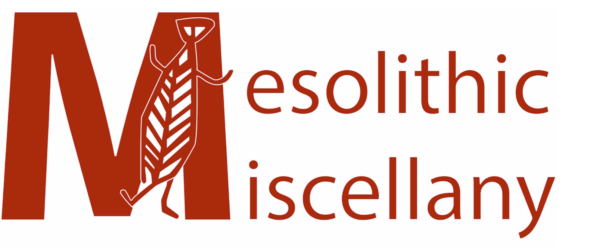

```{r global_options, include=FALSE}
knitr::opts_chunk$set(fig.pos = 'H')
```

# Introduction {#introduction}
Here is the text!

## Subheading
Lorem ipsum dolor sit amet, consectetur adipiscing elit. Aenean ut elit odio. Donecfermentum tellus neque, vitae fringilla orci pretium vitae. Fusce maximus finibus facilisis. Donec ut ullamcorper turpis. Donec ut porta ipsum. Nullam cursus mauris a sapien ornare pulvinar. Aenean malesuada molestie erat quis mattis. Praesent scelerisque posuere faucibus.
```{r logo, echo=FALSE, fig.align='center', fig.cap="Empty caption", fig.pos="H", out.width='20%'}

```
Praesent nunc nulla, ullamcorper ut ullamcor-per sed, molestie ut est. Donec consequat libero nisi, non semper velit vulputate et.Quisque eleifend tincidunt ligula, bibendum finibus massa cursus eget. Curabituraliquet vehicula quam non pulvinar. Aliquam facilisis tortor nec purus finibus, sitamet elementum eros sodales. 


# Tables
raesent nunc nulla, ullamcorper ut ullamcor-per sed, molestie ut est. Donec consequat libero nisi, non semper velit vulputate et.Quisque eleifend tincidunt ligula, bibendum finibus massa cursus eget. Curabituraliquet vehicula quam non pulvinar. Aliquam facilisis tortor nec purus finibus, sitamet elementum eros sodales.

```{r tableo, echo=FALSE}
table1 <- tibble::tribble(
    ~Table.Header,  ~Second.Header,
     "Table Cell",        "Cell 2",
         "Cell 3",        "Cell 4"
  )
knitr::kable(table1,
             caption = "Empty caption")
```

## subheading
Ut porta porttitor vestibulum. Integer molestie, leout maximus aliquam, velit dui iaculis nibh, eget hendrerit purus risus sit amet do-lor. Sed sed tincidunt ex. Curabitur imperdiet egestas tellus Figure \@ref(fig:logo)) or Table \@ref(tab:tableo)) in iaculis. 

### subsubheading
Maecenasante neque, pretium vel nisl at, lobortis lacinia neque. In gravida elit vel volutpatimperdiet. Sed ut nulla arcu. Proin blandit interdum ex sit amet laoreet. Phasellusefficitur, sem hendrerit mattis dapibus, nunc tellus ornare nisi, nec eleifend enimnibh ac ipsum.  Aenean tincidunt nisl sit amet facilisis faucibus. Donec odio erat,bibendum eu imperdiet sed, gravida luctus turpis.


```{r echo=FALSE, fig.cap="empty caption",fig.align='center',fig.pos="H", message=FALSE, warning=FALSE,out.width='40%'}
library(tidyverse)
mtcars %>% 
  select(mpg,disp) %>% 
  ggplot()+ aes(mpg,disp)+
  geom_point()

```
